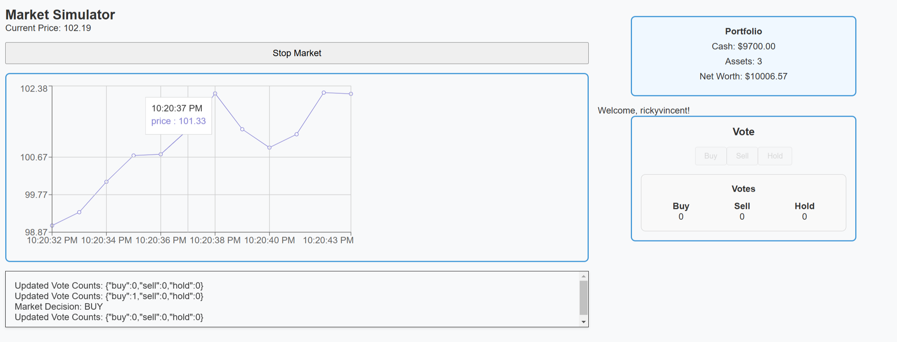

# Stock Market Simulator

This is basic trading simulator that allows all users to collectively vote on what decision (buy, sell, hold) to make every short period, with the goal of collectively making the most money. Tested at UF SASE Spring GBM 3 with 50 concurrent users.

Frontend is deployed on https://stock-simulator-delta.vercel.app/, and backend at http://stockmarketsimulator.fly.dev/.

## Info
Built using Bun websockets and React. Surprisingly, I couldn't find any similar market simulator available.

